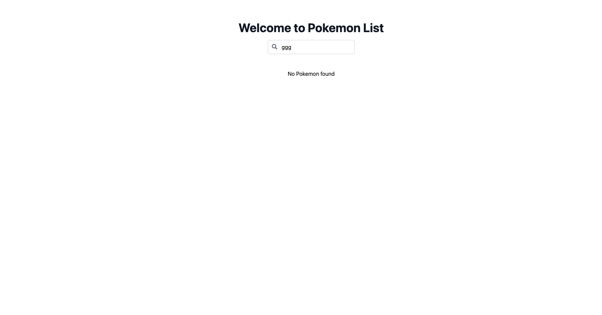
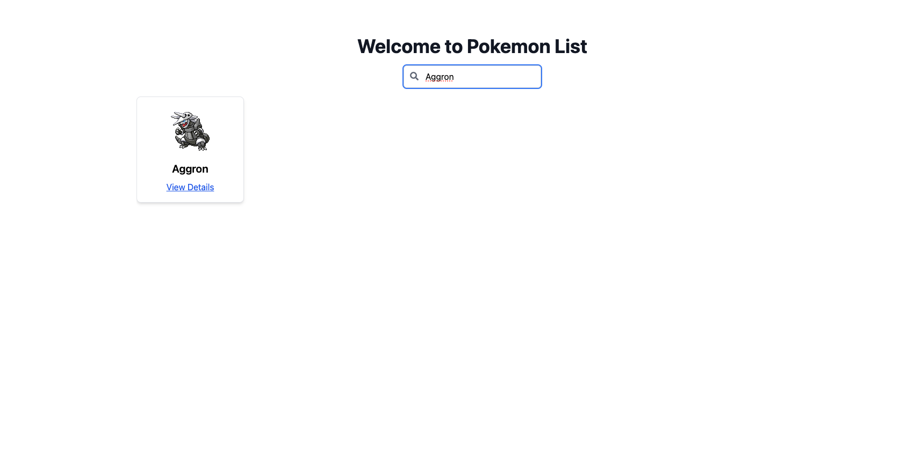
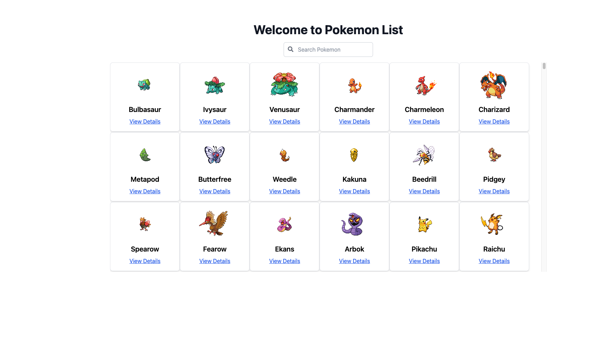
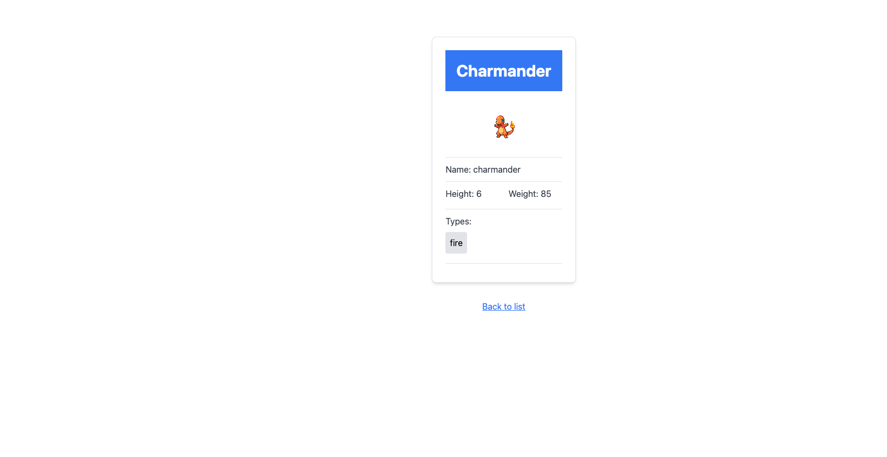

# Pokemon React App

This repository contains a React application that fetches and displays Pokemon data from the [PokeAPI](https://pokeapi.co/).

## Features

- Fetches Pokemon data from the PokeAPI.
- Built with React, [Vite](https://vitejs.dev/), Redux Toolkit, and RTK Query.
- Implements loading and error handling for API requests.
- Utilizes caching for improved performance.
- Written in TypeScript with type checking.
- Includes test cases for all types.
- Utilizes custom hook `useDebounce` for improved performance in search.
- Implements routing with React Router DOM.
- Uses React Window for efficient rendering of large lists.
- Separates styles into individual files, using Tailwind CSS.
- Utilizes `apply` from Tailwind for consistent styling.
- Implements skeleton cards for loading data from the API.
- Styles processed with PostCSS.


## Screenshots

### Empty Search



### Item Search



### List Items



### Skeleton Items


### Item Details




## Installation

1. Clone the repository:

   ```bash
   git clone https://github.com/mansourelbash/pokemon-vite-react.git
   ```

2. Navigate to the project directory:

   ```bash
   cd pokemon-vite-react
   ```

3. Install dependencies:

   ```bash
   npm install
   ```

## Usage

1. Start the development server:

   ```bash
   npm run dev
   ```

2. Open [http://localhost:5173/](http://localhost:5173/) in your browser.

## Testing

Run tests using:

```bash
npm test
```

## Credits

This project is created by [Mansour El-Bashabsheh].
.